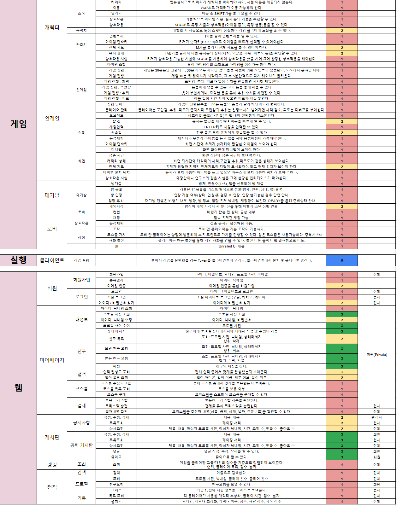
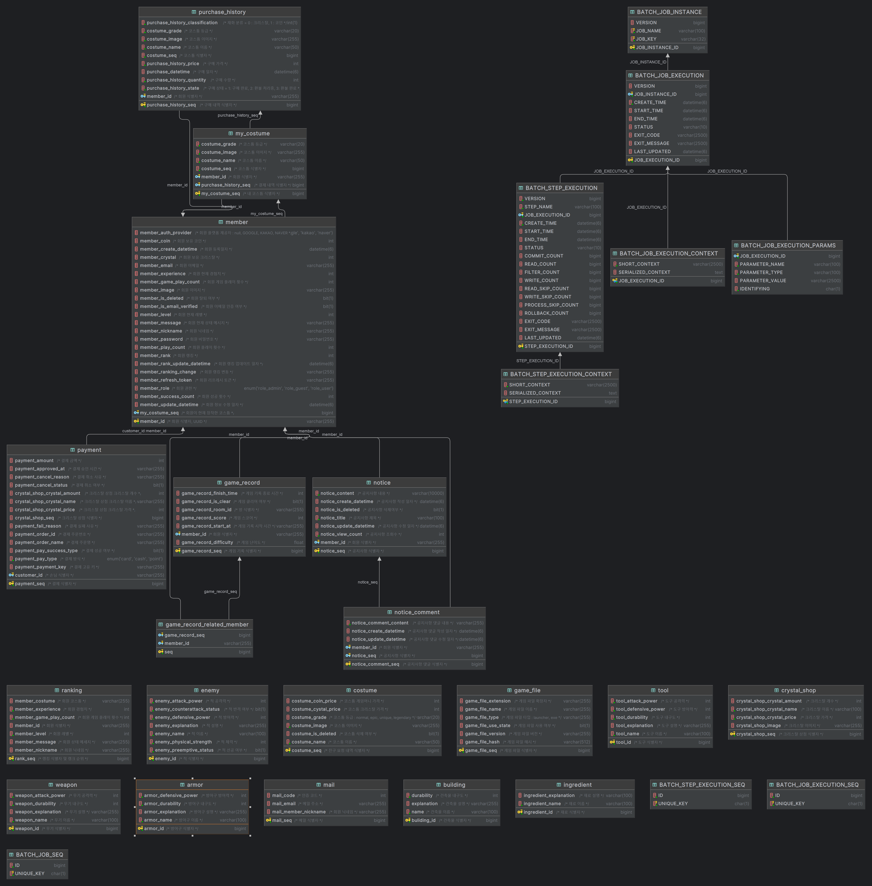

# LostInFrost
- 평범한 생존게임은 가라! 다양한 상호작용과 랜덤 카드 선택을 통한 효과를 챙겨 30분을 버텨라! 

## 소개 및 시연 영상

https://youtu.be/jYyTf2IaZ80?si=EQIhuI_hKdkdgBKP
## 개요
전략을 세워 추위와 배고픔 등 생존 요건을 갖춰가며 구조대가 올 때까지 버티세요!
 - 워크래프트 유즈맵인 겨울나기에서 영감을 받고, 언레일드의 상호작용 방식과 로그라이크를 접목하여 새롭고 차별화된 생존게임을 경험할 수 있습니다. 간편한 조작과 난이도 조절을 통해 누구나 즐길 수 있으며 나만의 전략을 세워 게임 플레이를 다채롭게 이어갈 수 있습니다.

## Why?
다른 플레이어와 협력하여 생존을 도모할 수 있으며 다양한 전략을 통한 플레이 경험과, 생존이라는 명목하에 고도의 집중력을 끌어올리는 게임을 개발하고자 하였습니다. 

## 주요 서비스 화면
### 로그인 화면

#### 코스튬 뽑기

#### 랭킹

#### 채팅

#### 방 생성

#### 게임 시작

#### 채광

#### 아이템 제작

#### 건물 제작

#### 상호작용 : 피로도 수치 내리기

#### 게임 종료 : 클리어

#### 게임 서비스 플로우는 [여기](https://github.com/zzckckck3/LostInFrost/blob/master/%EC%82%B0%EC%B6%9C%EB%AC%BC/GAMEPLAYING_README.md)에서!
#### 게임 플레잉 플로우는 [여기](https://github.com/zzckckck3/LostInFrost/blob/master/%EC%82%B0%EC%B6%9C%EB%AC%BC/GAMESERVICE_README.md)에서!

#### 게임 (빌드)실행 파일은 [여기](https://drive.google.com/file/d/1iaUEOmaEvWR93LeBZ2TKRu2au-JNrJv_/view)에서!

---

## 개발 환경
### FrontEnd
### BackEnd
- Spring Boot
- OAuth2
### Game Engine
- Unity Engine
- C#

## 협업 툴
- Git
- Jira
- Mattermost
- Plastic SCM
- Google Drive
- Notion
## 요구사항 정의서

## ER Diagram

## 팀원 역할
게임
1. 곽강한 (팀장) : 동물 AI, 동기화 작업 전반, 동물 및 채집대상 오브젝트 풀링, 맵 제작
2. 이재진 : 
    - 인게임 : UI기능, 아이템 조합, 카드 시스템, 인벤토리, 핫키, 미니맵
    - 상호작용 : 오브젝트 상호작용, 건물 상호작용
    - Manager : UserStatus관리, Time관리
3. 이수민 : 동기화 작업 전반, 건물 건설, 도구 장착, 캐릭터 이동/공격/수집, 인벤토리 데이터 검증, 오브젝트 풀링(재료, 빌딩), 
4. 손민우 : 게임 UI, 코스튬, 뽑기, 포톤 서버 및 API 통신 개발. 맵(로비, 대기방) 개발.
   
웹
1. 김범창 [FE] : React 전반, 런쳐
2. 진병욱 [BE, CI/CD]
    - 게임 및 홈페이지에서 필요한 API 개발 및 MSA 설계 및 구축
    - 각 서비스 별 도커를 통한 빌드 이미지 관리 및 Jenkins 파이프라인을 통한 자동 배포

