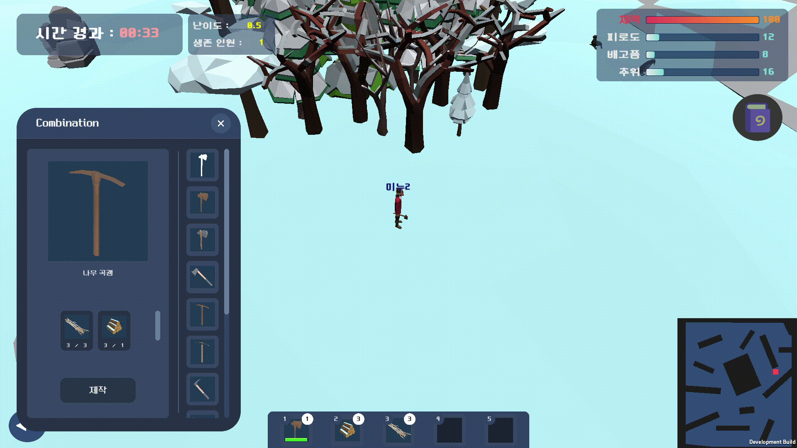
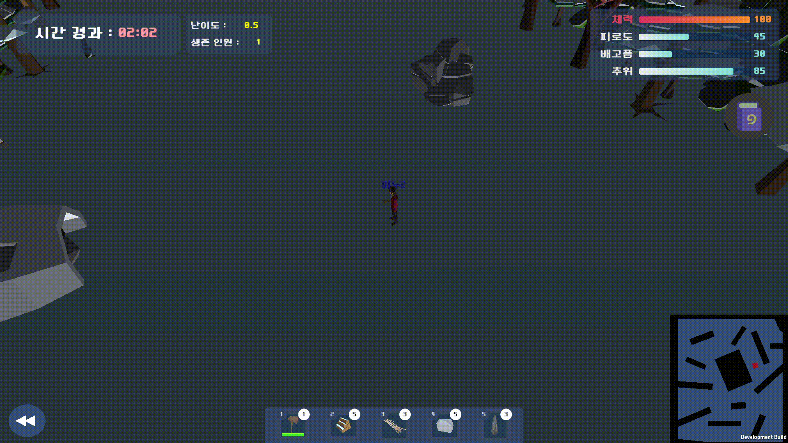

## 게임 플레잉 플로우 및 기능
### 인게임 : 프로스트 맵

#### 벌목

#### 채광

#### 사냥 : 공격

#### 아이템 제작

#### 건물 제작

#### 상호작용 : 추위 수치 내리기

#### 상호작용 : 배고픔 수치 내리기

#### 상호작용 : 피로도 수치 내리기

#### 게임 종료 : 클리어

#### 게임 종료 : 죽음(HP 0)

#### 게임 종료 : 타임 오버(헬리콥터 탑승 실패)

