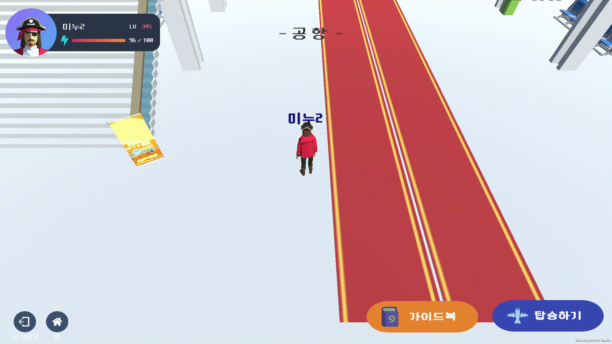
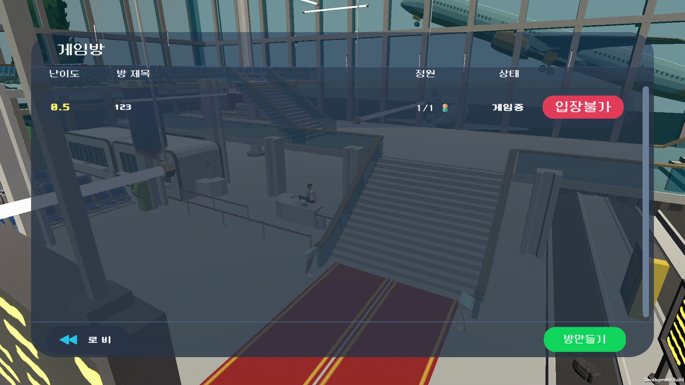

## 게임 서비스 플로우 및 기능
### 메인 홈 UI

### 로그인 화면

#### 코스튬 변경

#### 코스튬 뽑기

#### 랭킹

#### 가이드북

#### 프로필 변경

### 로비 : 공항 UI

#### 채팅

### 게임 리스트 UI

#### 방 입장 :성공

#### 방 입장 :실패

#### 방 생성

#### 레디

#### 강퇴 : 방장

#### 강퇴 : 유저

#### 게임 시작

